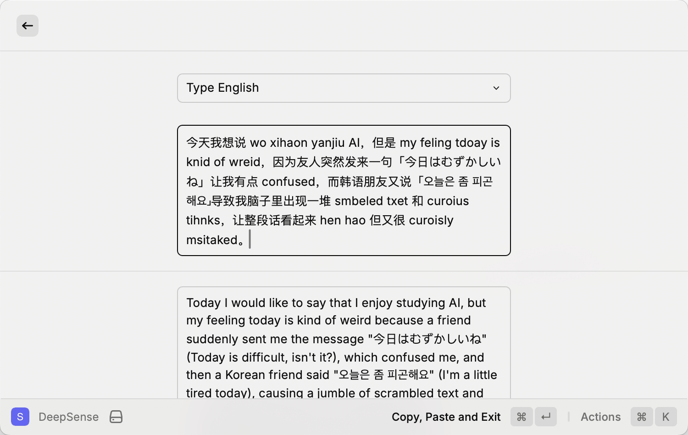
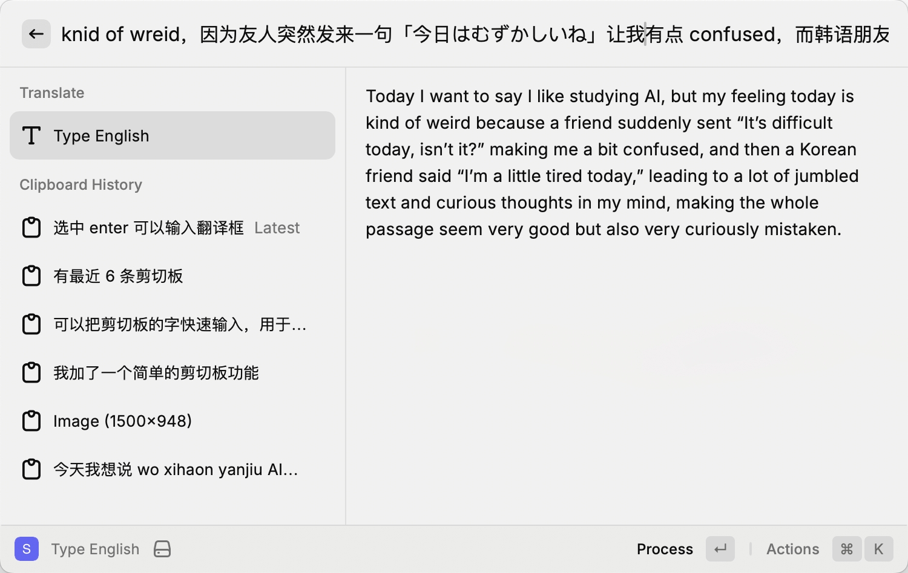

Last Updated: 2025-12-07

# SenseType AI

An AI-powered input engine for Raycast that senses your intent and transforms your typing.

## Features

- **Two input modes**: DeepSense (multi-line) and QuickSense (single-line)
- **Multiple prompts**: Type English, Type Chinese, Improve Writing, Fix Grammar, etc.
- **Selected text support**: Auto-fills and processes selected text when launching QuickSense
- **Clipboard history**: Access recent clipboard items, append to input or paste directly
- **Custom prompts**: Add your own prompts via JSON in preferences
- **Any OpenAI-compatible API**: Works with OpenRouter, OpenAI, local LLMs, etc.
- **Automatic copy-to-clipboard** on exit

## Screenshots

| DeepSense | QuickSense |
|-----------|------------|
|  |  |

## Commands

| Command | Description |
|---------|-------------|
| **DeepSense** | Multi-line input for longer text (Form UI) |
| **QuickSense** | Single-line quick input with prompt selection (List UI) |
| **Type English** | Quick input preset for English typing |
| **Type Chinese** | Quick input preset for Chinese typing |
| **Improve Writing** | Quick input preset for improving writing |

## Usage

### DeepSense (Multi-line)
1. Search "DeepSense" in Raycast
2. Select a prompt from dropdown
3. Type or paste text, press `Enter` to process
4. `Cmd+Enter` to copy, paste and exit

### QuickSense (Single-line)
1. Search "QuickSense" or preset commands (e.g., "Type English")
2. If text is selected in another app, it auto-fills and processes immediately
3. Type in search bar, press `Enter` to process
4. `Cmd+Enter` to copy, paste and exit
5. Use clipboard history section to append previous items to input

## Configuration

In Raycast preferences:

- **API Key**: Your API key (required)
- **API Base URL**: OpenAI-compatible endpoint (default: `https://openrouter.ai/api/v1`)
- **Model**: Model ID (default: `google/gemini-2.5-flash-lite`)
- **Custom Prompts**: JSON array to add custom prompts

### Custom Prompts Example
```json
[{"name": "Translate", "prompt": "Translate to English"}]
```

## Development

```bash
npm install
npm run dev    # Start development
npm run build  # Build extension
npm test       # Run tests
```

## Project Structure

```
src/
├── deep.tsx           # DeepSense (multi-line Form UI)
├── quick.tsx          # QuickSense (single-line List UI)
├── quick-*.tsx        # Symlinks for preset commands
├── openrouter.ts      # API client
├── prompts.json       # Default prompts
└── __tests__/         # Unit tests
```
